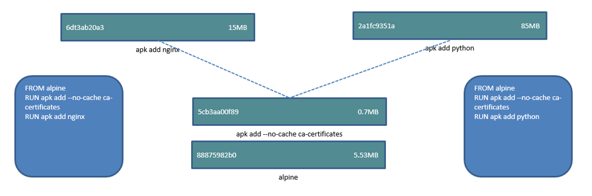
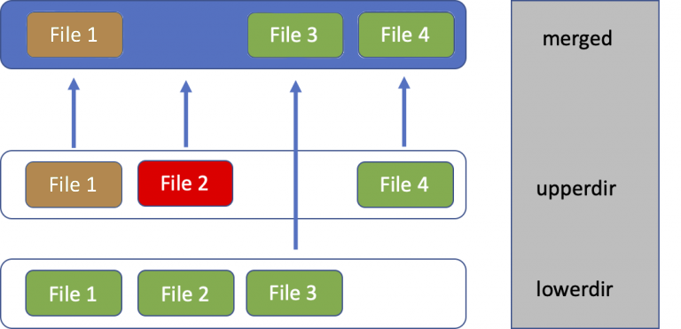

# docker 的 storage driver

## 为什么选择 overlay2

容器就是隔离的进程，而运行一个进程需要 `linux 内核` + `rootfs` + `相关文件`，内核是使用宿主机的，非内核部分就是容器镜像，docker 需要存储的就是 **容器镜像** 和 **容器层**（容器是单独的一层读写层），从单个容器镜像来讲，容器镜像包含的内容可能性大体分为以下几类：
- rootfs + bin
- rootfs + runtime + script/file
- rootfs + package + bin
- rootfs + package + runtime + script/file
- bin，例如 c 语言静态编译的 k8s pause 镜像，或者静态编译的 go 二进制

而且实际使用中，主要的不同是后面的部分，例如 rootfs 都是 debian ，后面的部分有差异性，如果每个镜像都单独存一份，会造成空间浪费没有复用。docker 这方面有很多存储驱动实现，支持的 storage driver 有以下：
- btrfs
- devicemapper
- ~~overlay~~
- overlay2
- zfs
- vfs
- ~~AUFS~~
- ...

AUFS 和 overlay 都废弃了，被 overlay2 替代了，devicemapper 从接触角度来讲 bug 挺多的不推荐使用，btrfs 和 zfs 也支持写时复制，前者需要系统支持，后者是新版本内核特性且存在 bug，overlay2 目前是最广泛使用和最稳定的，而且性能也不错，而 vfs 是兜底的存储，在都不支持的时候可以考虑它，它的缺点是无法层复用导致占据的容量会多很多。



图里是一个简单例子，两个 docker 镜像各自看都有三层，实际并不是占用 6 层大小，而是相同的两层 + 各自不同的一层大小。

## 镜像存储结构

下面是一个干净机器上安装 docker 后拉取 alpine 的目录变化：

```shell
$ docker info --format '{{.Driver}}'                  
overlay2
$ cd /var/lib/docker/;ll overlay2/
total 0
brw------- 1 root root 8, 16 May 30 14:23 backingFsBlockDev
drwx------ 2 root root     6 May 30 14:23 l
$ docker pull alpine
$ ll overlay2/
total 0
drwx--x--- 3 root root    30 May 30 14:24 6f40b16cd210a5aaa4415b086da6b6e138d0f7ca24089dcd88d5ad3bd02a988b
brw------- 1 root root 8, 16 May 30 14:23 backingFsBlockDev
drwx------ 2 root root    40 May 30 14:24 l
$ ll overlay2/6f40b16cd210a5aaa4415b086da6b6e138d0f7ca24089dcd88d5ad3bd02a988b/
total 4
drwxr-xr-x 19 root root 199 May 30 14:24 diff
-rw-r--r--  1 root root  26 May 30 14:24 link
$ ll overlay2/6f40b16cd210a5aaa4415b086da6b6e138d0f7ca24089dcd88d5ad3bd02a988b/diff/
total 12
drwxr-xr-x  2 root root 4096 May 22 17:47 bin
drwxr-xr-x  2 root root    6 May 22 17:47 dev
drwxr-xr-x 17 root root 4096 May 22 17:47 etc
drwxr-xr-x  2 root root    6 May 22 17:47 home
drwxr-xr-x  6 root root  230 May 22 17:47 lib
drwxr-xr-x  5 root root   44 May 22 17:47 media
drwxr-xr-x  2 root root    6 May 22 17:47 mnt
drwxr-xr-x  2 root root    6 May 22 17:47 opt
dr-xr-xr-x  2 root root    6 May 22 17:47 proc
drwx------  2 root root    6 May 22 17:47 root
drwxr-xr-x  2 root root    6 May 22 17:47 run
drwxr-xr-x  2 root root 4096 May 22 17:47 sbin
drwxr-xr-x  2 root root    6 May 22 17:47 srv
drwxr-xr-x  2 root root    6 May 22 17:47 sys
drwxrwxrwt  2 root root    6 May 22 17:47 tmp
drwxr-xr-x  7 root root   66 May 22 17:47 usr
drwxr-xr-x 12 root root  137 May 22 17:47 var
$ cat overlay2/6f40b16cd210a5aaa4415b086da6b6e138d0f7ca24089dcd88d5ad3bd02a988b/diff/etc/os-release 
NAME="Alpine Linux"
ID=alpine
VERSION_ID=3.20.0
PRETTY_NAME="Alpine Linux v3.20"
HOME_URL="https://alpinelinux.org/"
BUG_REPORT_URL="https://gitlab.alpinelinux.org/alpine/aports/-/issues"
```

alpine ubuntu 和 debian 很多基础镜像的 Dockerfile 都是从空镜像构建的，类似下面这样：

```Dockerfile
FROM scratch
ADD xx-base-rootfs.tar.gz /
CMD ["/bin/bash"]
```

**为了便于阅读，下面的 overlay2 的长目录名字会缩写** ，然后构建图片左侧镜像：

```shell
$ cat > Dockerfile << EOF
FROM alpine
RUN apk add --no-cache ca-certificates
RUN apk add --no-cache nginx
EOF
$ docker build . -t nginx
$  ls -al overlay2/
total 0
drwx--x---  6 root root   256 May 30 16:26 .
drwx--x--- 13 root root   189 May 30 14:23 ..
drwx--x---  4 root root    55 May 30 16:26 33741b8629298eac70033bd71845baf11e0d2f78093d5340c8ee762241bf5e23
drwx--x---  3 root root    47 May 30 16:26 6f40b16cd210a5aaa4415b086da6b6e138d0f7ca24089dcd88d5ad3bd02a988b
drwx--x---  4 root root    72 May 30 16:26 b2c19bb33e1cfe439bd7319cb07cf90b02f9f557c6d48eac12adb17fe345e1e4
brw-------  1 root root 8, 16 May 30 14:23 backingFsBlockDev
drwx------  2 root root   108 May 30 16:26 l
$  find   overlay2/b2c19bb33.../diff/  -type d 
overlay2/b2c19bb33.../diff/
overlay2/b2c19bb33.../diff/etc
overlay2/b2c19bb33.../diff/etc/apk
overlay2/b2c19bb33.../diff/etc/apk/protected_paths.d
overlay2/b2c19bb33.../diff/etc/ca-certificates
overlay2/b2c19bb33.../diff/etc/ca-certificates/update.d
overlay2/b2c19bb33.../diff/etc/ssl
overlay2/b2c19bb33.../diff/etc/ssl/certs
overlay2/b2c19bb33.../diff/lib
overlay2/b2c19bb33.../diff/lib/apk
overlay2/b2c19bb33.../diff/lib/apk/db
overlay2/b2c19bb33.../diff/lib/apk/exec
overlay2/b2c19bb33.../diff/usr
overlay2/b2c19bb33.../diff/usr/bin
overlay2/b2c19bb33.../diff/usr/local
overlay2/b2c19bb33.../diff/usr/local/share
overlay2/b2c19bb33.../diff/usr/local/share/ca-certificates
overlay2/b2c19bb33.../diff/usr/sbin
overlay2/b2c19bb33.../diff/usr/share
overlay2/b2c19bb33.../diff/usr/share/ca-certificates
overlay2/b2c19bb33.../diff/usr/share/ca-certificates/mozilla
$ find overlay2/33741b86.../diff/ -type d 
overlay2/33741b86.../diff/
overlay2/33741b86.../diff/etc
overlay2/33741b86.../diff/etc/apk
overlay2/33741b86.../diff/etc/logrotate.d
overlay2/33741b86.../diff/etc/nginx
overlay2/33741b86.../diff/etc/nginx/http.d
overlay2/33741b86.../diff/etc/nginx/modules
overlay2/33741b86.../diff/lib
overlay2/33741b86.../diff/lib/apk
overlay2/33741b86.../diff/lib/apk/db
overlay2/33741b86.../diff/lib/apk/exec
overlay2/33741b86.../diff/run
overlay2/33741b86.../diff/run/nginx
overlay2/33741b86.../diff/usr
overlay2/33741b86.../diff/usr/lib
overlay2/33741b86.../diff/usr/lib/nginx
overlay2/33741b86.../diff/usr/lib/nginx/modules
overlay2/33741b86.../diff/usr/sbin
overlay2/33741b86.../diff/usr/share
overlay2/33741b86.../diff/usr/share/nginx
overlay2/33741b86.../diff/var
overlay2/33741b86.../diff/var/lib
overlay2/33741b86.../diff/var/lib/nginx
overlay2/33741b86.../diff/var/lib/nginx/html
overlay2/33741b86.../diff/var/lib/nginx/tmp
overlay2/33741b86.../diff/var/log
overlay2/33741b86.../diff/var/log/nginx
overlay2/33741b86.../diff/var/www
overlay2/33741b86.../diff/var/www/localhost
overlay2/33741b86.../diff/var/www/localhost/htdocs
```

然后构建右侧的 python 镜像：

```shell
$ cat > Dockerfile << EOF
FROM alpine
RUN apk add --no-cache ca-certificates
RUN apk add --no-cache python3
EOF
$ docker build . -t python
$ ls -al overlay2/
total 0
drwx--x---  7 root root   328 May 30 16:38 .
drwx--x--- 13 root root   189 May 30 14:23 ..
drwx--x---  4 root root    55 May 30 16:26 33741b8629298eac70033bd71845baf11e0d2f78093d5340c8ee762241bf5e23
drwx--x---  3 root root    47 May 30 16:26 6f40b16cd210a5aaa4415b086da6b6e138d0f7ca24089dcd88d5ad3bd02a988b
drwx--x---  4 root root    55 May 30 16:38 8f6ad7d43844e11e411fe6b2b635299b1213eccc4269a5ad825880c80528444a
drwx--x---  4 root root    72 May 30 16:38 b2c19bb33e1cfe439bd7319cb07cf90b02f9f557c6d48eac12adb17fe345e1e4
brw-------  1 root root 8, 16 May 30 14:23 backingFsBlockDev
drwx------  2 root root   142 May 30 16:38 l
# 增加了一个 8f6 目录
$ find overlay2/8f6ad7d4384.../diff -type d
...
overlay2/8f6ad7d4384.../diff/lib
overlay2/8f6ad7d4384.../diff/lib/apk
overlay2/8f6ad7d4384.../diff/lib/apk/db
overlay2/8f6ad7d4384.../diff/lib/apk/exec
overlay2/8f6ad7d4384.../diff/usr
overlay2/8f6ad7d4384.../diff/usr/bin
overlay2/8f6ad7d4384.../diff/usr/include
overlay2/8f6ad7d4384.../diff/usr/include/python3.12
overlay2/8f6ad7d4384.../diff/usr/lib
overlay2/8f6ad7d4384.../diff/usr/lib/python3.12
overlay2/8f6ad7d4384.../diff/usr/lib/python3.12/__phello__
overlay2/8f6ad7d4384.../diff/usr/lib/python3.12/__phello__/__pycache__
overlay2/8f6ad7d4384.../diff/usr/lib/python3.12/__pycache__
...
```

可以实际看到目录是只占用 4 层大小。Docker 镜像实际由多个只读层和元数据组成：

1. 层（Layers）：每一层代表一次文件系统变更（例如添加、修改或删除文件）。这些层是只读的，并且可以在多个镜像之间共享，从而节省存储空间。
2. 元数据（Metadata）：包含镜像的各种配置和信息：
    - 配置（Config）：包括容器的默认命令（CMD）、启动进程（ENTRYPOINT）、工作目录（WORKDIR）、环境变量（ENV）、暴露端口（EXPOSE）等。
    - 标签（Labels）：用于存储镜像的额外信息，如版本号、作者等，以键值对的形式存在。
    - 环境变量（Environment Variables）：在构建镜像时通过 ENV 指令设置的环境变量，运行容器时会传递给容器内的进程。
    - 历史记录（History）：记录了每一层的创建信息、构建命令历史等，用于追踪镜像的构建过程。

## overlay2 存储驱动原理

在 linux 里，我们把一个块设备 `/dev/sdb1` 挂载到一个路径 `/data` 上，如果 `/data` 目录之前有内容，会被隐藏，`/data/` 下是块设备 `/dev/sdb1` 上的文件系统上的文件。那么有没有一种挂载相关的，让我们能够把 `>=2` 个目录合并挂载到一个路径上，overlay2 就是这样的，它的概念如图所示



overlayfs 分为 lowerdir 、upperdir 、workdir 和 merged，按照图例所示：
1. 底下第一层是 File 1 2 3
2. 第二层是 File1 修改了，File 2 删除了，添加了 File 4
3. 最终叠加的目录 merged 内的内容就是如图顶部所示

upperdir 对于 lowerdir 文件的修改，并不会实际的修改下层文件，而是复制到当前层修改。而删除一个 lowerdir 文件，则是会在 upperdir 创建 whiteout 文件，相当与 `mknod <name> c 0 0`，从上到下读取到这样的 char 字符设备会直接返回不存在。

存储的 layer + overlayfs 的叠加挂载，然后容器的 rootfs 就是完整的了。

## 容器镜像 diff

前面的图，可以类比成下面的 Dockerfile

```Dockerfile
FROM xxx #包含 File 1 2 3
RUN set -eux; \
    sed -i 's#xxx#yyy#' File1; \
    rm -f File2; \
    echo 123 > File4;
```

构建的镜像会把 upperdir 的变动也保存一层，整体镜像有两层，实际上 File2 并没有真正删掉，按照实际举例很多人会这样写：

```Dockerfile
FROM xxxx
COPY xxx.tar.gz /tmp
RUN set -eux; \
    tar zxf xxx.tar.gz; \
    cd xxx; \
    ./configure; \
    make; \
    make install; \
    rm -rf /tmp/xxx xxx;
```

假如 `xxx.tar.gz` 有 200M，而编译安装只会产生 10M ，那么最终镜像的大小会是 `基础镜像` + COPY 层的 `200M` + RUN 层的 `10M`，这显然是不合理的。

最常见的解决办法就是 RUN 里直接下载处理：

```
FROM xxxx
RUN set -eux; \
    wget https://xxx/xxx.tar.gz; \
    tar zxf xxx.tar.gz; \
    cd xxx; \
    ./configure; \
    make; \
    make install; \
    rm -rf xxx;
```

## 链接

- [目录](directory.md)
- 上一节：[前言](preface.md)
- 下一节：[diff 的更多案例](02.md)

## 一些额外信息

`/etc/docker/daemon.json` 没有配置 `"storage-driver": "overlay2",` 下，docker 会默认探测使用的驱动优先级：

```golang
// https://github.com/moby/moby/blob/master/daemon/graphdriver/driver_linux.go#L53
    priority = "overlay2,fuse-overlayfs,btrfs,zfs,vfs"
```

overlay2 是在 Linux 4.x 以上版本的内核添加的，但是  RHEL7/CentOS7 在 3.10.0-514 以上的内核也可以使用，因为红帽会 backport 一些内核特性到 3.10 上。

同时有个注意点，overlay2 可以在 ext4 和 xfs 文件系统上使用，但是如果 xfs 分区格式化不支持 `ftype=1` 会回退，最常见就是回退到 vfs ，然后导致层没复用，容量占用非常离谱。

```golang
// https://github.com/moby/moby/blob/e622cea55698e824ed6e362effe1701fd1e1552f/daemon/graphdriver/overlay2/overlay.go#L152-L158
	supportsDType, err := fs.SupportsDType(testdir)
	if err != nil {
		return nil, err
	}
	if !supportsDType {
		return nil, overlayutils.ErrDTypeNotSupported("overlay2", backingFs)
	}
```
